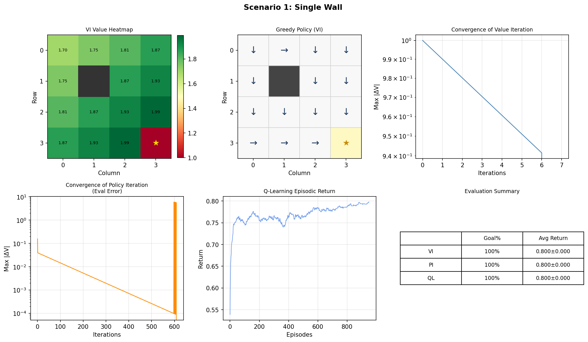
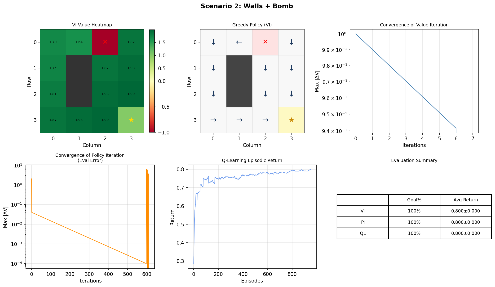
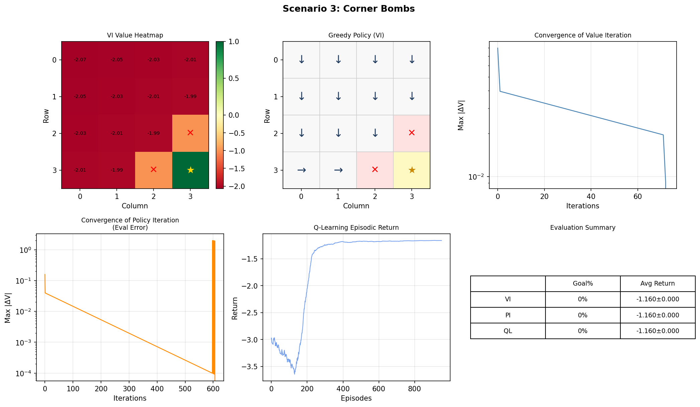
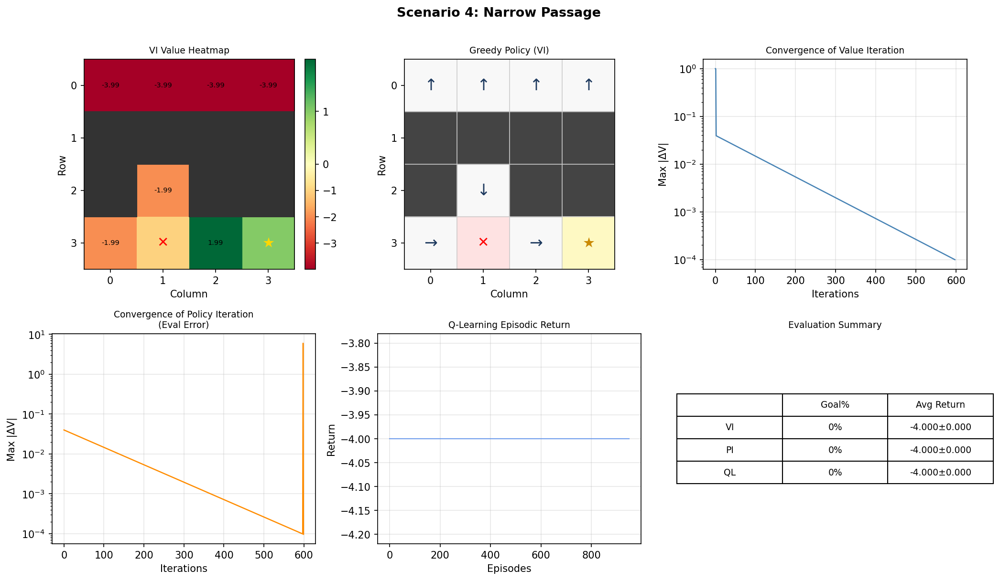

# reinforcement-learning-gridworld

Gridworld MDP examples and algorithms.

This repository contains small gridworld Markov Decision Process examples and implementations of:

- Value Iteration (VI)
- Policy Iteration (PI)
- Q-Learning (QL)

Usage
-----

Run the example script to generate the output images:

```bash
python3 mdp_gridworld.py
```

Dependencies
------------

See `requirements.txt`. Install with:

```bash
python3 -m pip install -r requirements.txt
```

Outputs
-------

The script saves visualizations for each scenario into `outputs/` (generated images are already included in this repo):







License & Contributing
----------------------

Feel free to open issues or PRs. Add a license file if you plan to make this public.
